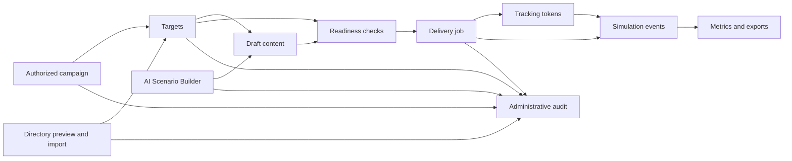

# Simulation Platform Feature Index

This index maps the modernized SocialFish simulation platform surfaces to their supporting data flows and safe operating assumptions. It is intended as the starting reference for operators and developers who need to understand how campaign management, target import, AI drafting, delivery, metrics, directory sync, and audit controls fit together.

## Feature Map

| Feature | Primary UI locations | Main data flow | Safe operating assumptions |
| --- | --- | --- | --- |
| [[Simulation-Campaigns]] | `/simulations`, `/simulations/campaigns`, `/simulations/campaigns/new`, `/simulations/campaigns/<id>` | Operators create authorized campaigns, choose email/SMS/voice channels, stage content and targets, review readiness, and start delivery jobs from the campaign detail page. | Administrative campaign routes require an authenticated operator session. Delivery readiness depends on a recorded authorization statement, active targets, channel content, and enabled providers. |
| [[Simulation-Target-Import]] | Campaign detail target panels, `/simulations/targets/sample.csv` | Manual entries, CSV rows, and directory-synced users normalize into campaign target records with contact, channel, department, manager, active-state, and source metadata. | Imports reject invalid contacts and duplicate active contacts within the same campaign. CSV errors are reported for operator correction before rows are accepted. |
| [[AI-Scenario-Generation]] | `/simulations/ai-builder`, `/ai-settings` | Provider settings determine the selectable generator. The builder validates the request, generates channel-specific draft content, records safety/audit metadata, and saves selected drafts for campaign delivery. | Local mock generation is deterministic and offline. Cloud and local HTTP provider shells fail closed until UI-managed credential retrieval and response parsing are implemented. Generated artifacts must remain scoped to authorized awareness training. |
| [[Simulation-Delivery-Tracking]] | Campaign detail delivery controls, `/simulations/deliveries/<job_id>`, public tracking token endpoints | Delivery preview builds from campaign content, active targets, and provider settings. Starting delivery creates jobs, attempts, artifacts, tracking tokens, and engagement events used by metrics. | Dry-run providers do not send external messages but exercise the same records and token flows. Public tracking routes are token-scoped and do not expose administrative data. Provider webhooks require signatures when a webhook secret is configured. |
| [[Simulation-Metrics]] | `/simulations/metrics`, campaign report/export links on `/simulations/campaigns/<id>` | Metrics aggregate `simulation_events` and target rollup fields into portfolio, campaign, channel, department, target, CSV, JSON, and printable report views. | Reporting and export routes require authentication. Export metadata is filtered and sensitive event metadata is redacted before JSON is returned. Dry-run metrics represent workflow validation unless recipients or testers actively trigger tokens. |
| [[Entra-Directory-Integration]] | `/integrations/directory`, `/integrations/directory/sync-jobs/<id>` | Directory providers define tenant/group settings and field mappings. Preview jobs stage users, validation results, and group metadata; import sync creates campaign targets for valid non-duplicate users. | Mock Entra mode is offline and deterministic. Microsoft Graph settings are configuration-ready but fail closed until credential retrieval is implemented. Preview does not add campaign targets until an operator runs import sync. |
| [[Simulation-Safety-Audit]] | `/audit-log`, `/audit-log/<id>`, campaign audit links, readiness messages on campaign delivery surfaces | High-value campaign, target, provider, AI, delivery, directory, export, and report actions write administrative audit events with actor, entity, campaign, channel, request context, and redacted metadata. | Audit pages require authentication. Secrets, tokens, credentials, passwords, and API keys are recursively redacted while safe placeholders and external secret references remain available for review. |

## Shared UI Navigation

The simulation platform starts at `/simulations`. From there, operators can reach campaign management, metrics, AI settings, the AI Scenario Builder, directory integrations, and audit review through page-level navigation and campaign detail links.

Campaign detail pages are the operational hub. They connect target staging, CSV sample download, directory import review, AI draft generation, delivery preview/start controls, delivery status links, metrics exports, printable reports, and campaign-scoped audit log filters.

## End-To-End Data Flow

The core records move in one direction: campaign scope and authorization establish the container, target import fills the audience, draft content supplies approved channel messages, delivery creates attempts and tracking tokens, engagement writes events, and reporting reads the normalized event and target rollup model.

## Operating Modes

| Mode | Applies to | Use case | External traffic |
| --- | --- | --- | --- |
| Mock AI | [[AI-Scenario-Generation]] | Local development, demos, and safe draft workflow validation. | None. |
| Dry-run delivery | [[Simulation-Delivery-Tracking]], [[Simulation-Metrics]] | Delivery workflow testing with real SocialFish records and simulated provider results. | None. |
| Mock Entra | [[Entra-Directory-Integration]], [[Simulation-Target-Import]] | Directory sync rehearsal with deterministic groups and users. | None. |
| Configured provider shells | AI, delivery, and Microsoft Graph provider settings | Stores UI-managed readiness metadata for future provider-backed integrations. | Fails closed until credential retrieval and provider-specific execution are implemented. |

## Safe Operating Checklist

- Confirm each campaign has a clear internal authorization statement before delivery.
- Use mock AI, dry-run delivery, and mock Entra sync for local verification when external credentials are unavailable.
- Review target validation and duplicate feedback before launching delivery.
- Use campaign detail readiness messages to resolve missing targets, drafts, authorization, or provider settings.
- Treat public tracking URLs as token-scoped telemetry endpoints, not administrative surfaces.
- Review `/audit-log` after high-risk operations and verify redaction before sharing exports outside the operator team.
